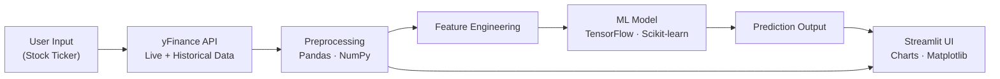

<div align="center">


**A machine learning platform that forecasts stock trends and prices in real time, from raw ticker data to interactive predictions**

[](https://www.python.org/)
[](https://www.tensorflow.org/)
[](https://scikit-learn.org/)
[](https://streamlit.io/)

<br/>

[](https://github.com/SamarthDharpure/TradeIQ/stargazers)
[](https://github.com/SamarthDharpure/TradeIQ/network)
[](https://github.com/SamarthDharpure/TradeIQ/issues)
[](https://github.com/SamarthDharpure/TradeIQ/commits)
[](#-license)

[Overview](#-overview) · [Features](#-features) · [Pipeline](#-pipeline) · [Tech Stack](#-tech-stack) · [Getting Started](#️-getting-started) · [Usage](#-usage) · [Screenshots](#-screenshots) · [Roadmap](#-roadmap)

</div>

<br/>

## 📖 Overview

**TradeIQ** is a machine learning–powered stock market prediction platform that turns raw historical price data into forward-looking forecasts. It combines a time-series model trained on S&P500 data with a real-time data feed from yFinance, wrapped in an interactive **Streamlit** app so a user can type a ticker and immediately see historical trends, live prices, and a predicted trajectory.

**Project timeline:** January 2025 – May 2025

<br/>

<div align="center">

|  🎯 Model Accuracy  |  🔮 Stocks Supported  |  ⚡ Training Speed  |  📈 Prediction Stability  |
|:---:|:---:|:---:|:---:|
|  **85%+**  |  **100+**  |  **+25% faster**  |  **+18% more stable**  |

</div>

<br/>

## ✨ Features

<table>
<tr>
<td width="50%">

### 🤖 AI/ML Forecasting
Time-series model achieving 85%+ accuracy on historical S&P500 datasets.

### 🔮 Broad Coverage
Predicts trends for 100+ global stocks from a simple ticker input.

### ⚡ Real-Time Data
Live market data pulled directly from the yFinance API.

</td>
<td width="50%">

### 📊 Interactive Charts
Dynamic, explorable visualizations built with Matplotlib and Pandas.

### 🔍 Efficient Training
Feature engineering cut training time by 25%.

### 🖥️ Streamlit UI
Clean, fast interface for ticker lookup and prediction exploration.

</td>
</tr>
</table>

<br/>

## 🔄 Pipeline



**Flow:** a ticker entered in the UI triggers a live pull from yFinance, which is cleaned and feature-engineered before being fed into the trained model. Both the raw historical series and the model's forecast are rendered back into the Streamlit app as interactive charts.

<br/>

## 🧑‍💻 Tech Stack

<div align="center">

| Layer | Technology |
|---|---|
| **Language** | [Python](https://www.python.org/) |
| **ML / Modeling** | [Scikit-learn](https://scikit-learn.org/) · [TensorFlow](https://www.tensorflow.org/) |
| **Data Handling** | [Pandas](https://pandas.pydata.org/) · [NumPy](https://numpy.org/) |
| **Data Source** | [yFinance API](https://pypi.org/project/yfinance/) |
| **Visualization** | [Matplotlib](https://matplotlib.org/) |
| **App / Frontend** | [Streamlit](https://streamlit.io/) |
| **Tooling** | [VS Code](https://code.visualstudio.com/) · Git |

</div>

<br/>

## 📂 Project Structure

```
TradeIQ/
├── app.py               # Main Streamlit app
├── model/                # ML models and training scripts
├── data/                 # Sample datasets
├── requirements.txt      # Dependencies
└── README.md
```

<br/>

## ⚙️ Getting Started

### Prerequisites
- Python 3.9+
- pip

### 1. Clone the repository

```bash
git clone https://github.com/SamarthDharpure/TradeIQ.git
cd TradeIQ
```

### 2. Install dependencies

```bash
pip install -r requirements.txt
```

### 3. Run the app

```bash
streamlit run app.py
```

<br/>

## 🚀 Usage

1. Launch the app and enter any **stock ticker** (e.g. `AAPL`, `TSLA`, `GOOGL`)
2. Pull **real-time financial data** via yFinance
3. Explore **dynamic charts** of historical stock trends
4. View **predicted future prices** generated by the ML model

<br/>

## 📸 Screenshots

<div align="center">

### Home Page


### Stock Prediction


### Prediction Graphs


</div>

<br/>

## 🗺️ Roadmap

- [ ] Support for crypto and forex tickers
- [ ] Model comparison view (LSTM vs. traditional regressors)
- [ ] Portfolio-level forecasting across multiple tickers
- [ ] Downloadable prediction reports (PDF/CSV)
- [ ] Dockerized deployment

> Have an idea? [Open an issue](https://github.com/SamarthDharpure/TradeIQ/issues) — contributions and suggestions are welcome.

<br/>

## 🤝 Contributing

Contributions are welcome!

1. Fork the repo
2. Create your feature branch (`git checkout -b feature/your-feature`)
3. Commit your changes (`git commit -m "Add: your feature"`)
4. Push to the branch (`git push origin feature/your-feature`)
5. Open a Pull Request

<br/>

## 📜 License

Distributed under the **MIT License**. See [`LICENSE`](LICENSE) for details.

<br/>

## 🧑‍💻 Author

<div align="center">

**Samarth Dharpure**

[](https://www.linkedin.com/in/samarth-dharpure-88a10b248/)
[](https://github.com/SamarthDharpure)

</div>

<br/>

<div align="center">

### ⭐ If TradeIQ was useful to you, consider giving it a star — it helps a lot!

</div>
